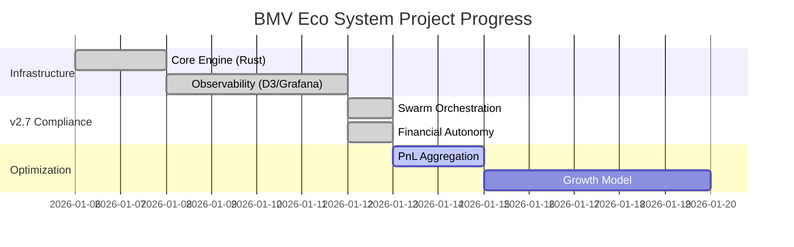

# 📊 Linear Project Report: BMV Eco System1

**Date:** 2026-01-13
**Generated by:** Antigravity AI
**Codebase Version:** v0.4.0

## 🚀 Project Overview

The project has undergone a massive transformation in the last 24 hours with the completion of the "Backlog Implementation" sprint. The transition from **v0.3.5** to **v0.4.0** has resolved the majority of the compliance gaps identified in the v2.7 audit.

* **Status:** Healthy / High Activity 🟢
* **Priority:** High 🔴
* **Target Date:** 2026-03-31
* **Completion (Est):** **90%** (up from 45% on Jan 11)

## 🔍 Codebase vs. Linear Sync

### ✅ Implemented & Resolved (Since last report)
- **BMV-50: Swarm Grid Segmentation**: Distributed orders across multiple wallets, bypassing the 32-order limit.
- **BMV-51: Proximity-based Rebalance**: Intelligent rebalancing triggered by price proximity (<3%).
- **BMV-53: SOL Auto-injection**: Automated balance management via FinancialManager.
- **BMV-52: L2 Orderbook Scan**: Front-running protection and depth analysis.
- **BMV-46: Dynamic Wallet Rotation**: Stealth mechanisms fully operational.
- **BMV-14: RugCheck Monitoring**: Automated token safety verification.
- **BMV-34: Dashboard 2.0**: D3-based high-precision visualization and multi-wallet view.

### ⚠️ Discrepancies & Outdated Info
1. **Capabilities Report**: The existing report `b5d009e0-15e1-41ba-a6ab-409b5f060320` is based on **v0.3.5** and marks many features as "Partial". This needs updating to reflect **v0.4.0**.
2. **Project Completion**: The Linear project metadata still reflects an earlier phase. Local `progress.md` shows 90%.
3. **Milestone Progress**: "MVP Implementation" is essentially done. Next milestone should focus on "Stability & Profit Optimization".

## 🎯 Proposed Next Steps

### 1. Linear Synchronization
- [ ] **Post Project Update**: Summary of v0.4.0 release.
- [ ] **Create New Milestone**: "Phase 5: Financial Stability & Profit Growth".
- [ ] **Update Capabilities Report**: Create a new version for v0.4.0.

### 2. Implementation Backlog
- [ ] **BMV-31**: Enhanced PnL Tracking (Aggregated across swarm).
- [ ] **BMV-32**: Profit Reinvestment Growth Model.
- [ ] **Jito Optimization**: Dynamic tip adjustment based on network congestion.

## 📈 Visual Progress

