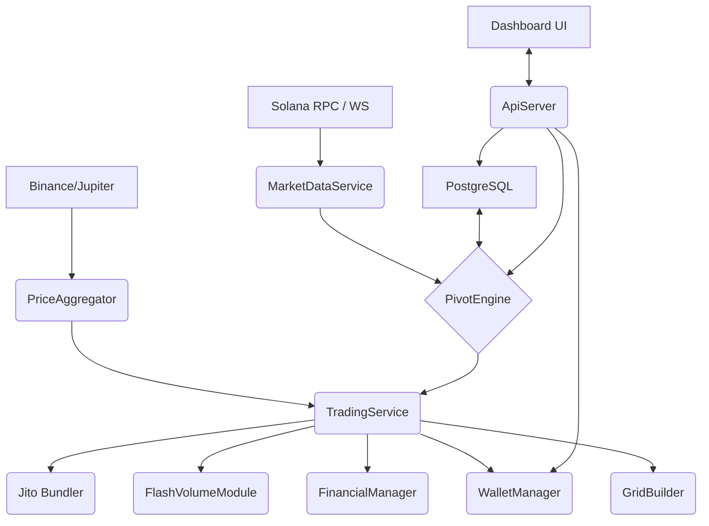

# Technical Specification v0.4.8 — BMV ES Bot / Техническая спецификация v0.4.8 — BMV ES Bot

## 1. Executive Summary / Краткое резюме
**EN:** The BMV Eco System Market Making Bot is a high-performance orchestration engine designed for the Solana ecosystem, specifically targeting OpenBook V2 liquidity management. Version 2.8 centers on the refinement of the **Pivot-Grid framework**, integrated with **Jito-Bundle atomic execution** to ensure MEV protection and capital efficiency. This document provides a comprehensive technical blueprint of the algorithms, API protocols, and architectural relationships that drive the system's operational autonomy.

**RU:** Бот маркет-мейкинга BMV Eco System — это высокопроизводительный механизм оркестрации, разработанный для экосистемы Solana, специально ориентированный на управление ликвидностью в OpenBook V2. Версия 2.8 фокусируется на совершенствовании **структуры Pivot-Grid**, интегрированной с **атомарным исполнением Jito-Bundle** для обеспечения защиты от MEV и эффективности использования капитала. Этот документ представляет собой подробный технический план алгоритмов, протоколов API и архитектурных связей, обеспечивающих операционную автономность системы.

---

## 2. The Mathematical Core: Dynamic Pivot Engine / Математическое ядро: Динамический Pivot Engine
**EN:** The system's "fair price" reference is governed by the **Pivot Engine**, which utilizes a highly responsive Pure Volume Weighted Average Price (VWAP) calculation. This engine is designed to balance long-term historical trends with immediate market volatility.

**RU:** Ориентир «справедливой цены» системы управляется механизмом **Pivot Engine**, который использует высокочувствительный расчет чистой средневзвешенной по объему цены (Pure VWAP). Этот механизм предназначен для балансировки долгосрочных исторических тенденций с немедленной рыночной волатильностью.

### 2.1 Pure VWAP Formula / Формула Pure VWAP
**EN:** The Pivot price is recalculated every tick using the following aggregate formula:

**RU:** Цена Pivot пересчитывается каждый тик по следующей агрегатной формуле:

$$Pivot = \frac{\sum (P_i \times V_i) + (P_{seed} \times V_{seed}) + (P_{24h} \times V_{24h})}{\sum V_i + V_{seed} + V_{24h}}$$

**EN:** Where:
- **$(P_i, V_i)$**: Real-time trade data ingested via the WebSocket `MarketDataService` and the PostgreSQL `trades_history`. The system employs a "deduplication window" to ensure trades stored in the database are not double-counted against ephemeral cache events.
- **$(P_{seed}, V_{seed})$**: A synthetic liquidity weight that ensures stability during cold starts or periods of extreme low volume. 
- **$(P_{24h}, V_{24h})$**: Aggregated market volume fetched from external providers (Binance/Jupiter), providing a "gravity point" towards broad market consensus.

**RU:** Где:
- **$(P_i, V_i)$**: Данные о сделках в реальном времени, поступающие через WebSocket `MarketDataService` и `trades_history` PostgreSQL. Система использует «окно дедупликации», чтобы сделки, хранящиеся в базе данных, не учитывались дважды по сравнению с эфемерными событиями кэша.
- **$(P_{seed}, V_{seed})$**: Синтетический вес ликвидности, обеспечивающий стабильность при «холодных стартах» или периодах экстремально низкого объема.
- **$(P_{24h}, V_{24h})$**: Агрегированный рыночный объем, полученный от внешних провайдеров (Binance/Jupiter), обеспечивающий «точку гравитации» в сторону широкого рыночного консенсуса.

### 2.2 Seeded Pivot Decay Logic / Логика затухания Seeded Pivot
**EN:** To prevent price manipulation in illiquid markets, the system seeds the initial calculation with a nominal daily volume. As the bot records actual trading history, the weight of the seed decays linearly:
- $V_{seed} = \max(0, LookbackDays - ElapsedDays) \times NominalDailyVolume$
- Once $ElapsedDays \ge LookbackDays$, the calculation transitions into a pure organic VWAP.

**RU:** Чтобы предотвратить манипулирование ценами на неликвидных рынках, система инициализирует первоначальный расчет номинальным дневным объемом. По мере того как бот записывает фактическую торговую историю, вес сида (seed) линейно затухает:
- $V_{seed} = \max(0, LookbackDays - ElapsedDays) \times NominalDailyVolume$
- Как только $ElapsedDays \ge LookbackDays$, расчет переходит к чисто органическому VWAP.

---

## 3. Order Grid & Swarm Orchestration / Сетка ордеров и оркестрация Swarm
**EN:** Version 2.8 mandates a 32-level order grid (16 BUY, 16 SELL) distributed across a **Wallet Swarm** to obfuscate presence and distribute financial risk.

**RU:** Версия 2.8 требует наличия 32-уровневой сетки ордеров (16 BUY, 16 SELL), распределенной по **Wallet Swarm** (рой кошельков), чтобы скрыть присутствие и распределить финансовые риски.

### 3.1 Exponential Distribution Algorithm / Алгоритм экспоненциального распределения
**EN:** Grid levels are not uniformly spaced; instead, they follow an exponential curve to prioritize liquidity near the pivot while maintaining a "tail" for flash crashes or parabolic moves:
- **Price Step**: $P_{n} = Pivot \pm (Step \times n^{\gamma})$, where $\gamma$ is the volatility-adjustment factor.
- **Volume Distribution**: $V_{n} = \frac{TotalDepth}{TotalWeight} \times Multiplier^{n-1}$. This ensures that liquidity density increases as the price moves further from the center, creating a "cushioning" effect.

**RU:** Уровни сетки не распределены равномерно; вместо этого они следуют экспоненциальной кривой, чтобы приоритизировать ликвидность вблизи пивота (pivot), сохраняя при этом «хвост» для внезапных обвалов (flash crashes) или параболических движений:
- **Ценовой шаг**: $P_{n} = Pivot \pm (Step \times n^{\gamma})$, где $\gamma$ — коэффициент поправки на волатильность.
- **Распределение объема**: $V_{n} = \frac{TotalDepth}{TotalWeight} \times Multiplier^{n-1}$. Это гарантирует, что плотность ликвидности увеличивается по мере удаления цены от центра, создавая эффект «амортизации».

### 3.2 L2 Scan & Front-running Protection / L2 Сканирование и защита от Front-running
**EN:** Before submitting orders, the `GridBuilder` performs a high-fidelity scan of the Top-20 L2 orderbook levels. 
- **Detection**: If an external order exceeds `large_order_threshold_sol`, it is flagged as a potential wall or institutional movement.
- **Reaction**: The bot shifts its corresponding grid level by `front_run_tick_size_sol` (typically 1-2 ticks) to gain priority in the queue, ensuring higher fill rates for the bot's passive liquidity.

**RU:** Перед отправкой ордеров `GridBuilder` выполняет высокоточное сканирование Top-20 уровней книги ордеров L2.
- **Обнаружение**: Если внешний ордер превышает `large_order_threshold_sol`, он помечается как потенциальная «стена» или институциональное движение.
- **Реакция**: Бот сдвигает свой соответствующий уровень сетки на `front_run_tick_size_sol` (обычно 1-2 тика), чтобы получить приоритет в очереди, обеспечивая более высокую частоту исполнения пассивной ликвидности бота.

### 3.3 Dynamic Swarm Rotation / Динамическая ротация Swarm
**EN:** To evade on-chain fingerprinting, grid segments are rotated among the swarm every tick:
- **Logic**: $WalletIndex = (SegmentIdx + \lfloor Now / TickInterval \rfloor) \pmod{WalletCount}$
- This ensures that no single wallet becomes a permanent marker for the bot’s bid/ask walls, effectively spreading the trading signature across 15-20 distinct addresses.

**RU:** Чтобы избежать идентификации в сети (on-chain fingerprinting), сегменты сетки ротируются внутри роя каждый тик:
- **Логика**: $WalletIndex = (SegmentIdx + \lfloor Now / TickInterval \rfloor) \pmod{WalletCount}$
- Это гарантирует, что ни один кошелек не станет постоянным маркером для стен спроса/предложения бота, эффективно распределяя торговый след по 15–20 различным адресам.

---

## 4. Operational Guardians: Rebalance & Risk / Операционные стражи: Ребалансировка и риски
**EN:** The system maintains health through a multi-layered trigger system that balances responsiveness with gas (Jito tip) efficiency.

**RU:** Система поддерживает работоспособность с помощью многоуровневой системы триггеров, которая балансирует отзывчивость с эффективностью затрат на газ (чаевые Jito).

### 4.1 Trigger Hierarchy / Иерархия триггеров
**EN:** 
1. **Deviation Guard**: Triggers if $Abs(MarketPrice - lastPivot) / lastPivot > RebalanceThreshold\%$.
2. **Proximity Guard**: Highly critical trigger if $Price$ is within $3\%$ of any grid level, preventing "order collision" and ensuring the grid remains "floating" around the current price.
3. **Entropy Guard**: Ensures a full grid refresh every 3600s even in stable markets to update wallet balances and rotate addresses.

**RU:** 
1. **Deviation Guard (Защита от отклонения)**: Срабатывает, если $Abs(MarketPrice - lastPivot) / lastPivot > RebalanceThreshold\%$.
2. **Proximity Guard (Защита от близости)**: Критически важный триггер, срабатывающий, если цена находится в пределах $3\%$ от любого уровня сетки, предотвращая «столкновение ордеров» и гарантируя, что сетка остается «плавающей» вокруг текущей цены.
3. **Entropy Guard (Защита энтропии)**: Обеспечивает полное обновление сетки каждые 3600 секунд даже на стабильных рынках для обновления балансов кошельков и ротации адресов.

### 4.2 Jito Bundle Atomicity / Атомарность Jito Bundle
**EN:** Rebalancing is performed as a **bundled atomic operation**. All 32 orders are cancelled and replaced in a single bundle (divided into valid sub-bundles). If the Solana network fails to include one part of the rebalance, the entire set is reverted by the Jito relayer, preventing expensive "one-sided" grid placements.

**RU:** Ребалансировка выполняется как **атомарная операция в бандле**. Все 32 ордера отменяются и заменяются в одном бандле (разделенном на валидные под-бандлы). Если сеть Solana не включает одну часть ребалансировки, весь набор откатывается ретранслятором Jito, что предотвращает дорогостоящее «одностороннее» размещение сетки.

---

## 5. Financial Autonomy & Infrastructure / Финансовая автономность и инфраструктура

### 5.1 FinancialManager: The Internal Treasury / FinancialManager: Внутреннее казначейство
**EN:** The bot manages its own SOL and USDC reserves without human intervention:
- **SOL Auto-injection**: When a swarm member's SOL drops below $0.05 SOL$, the `FinancialManager` uses the `JupiterAggregator` to swap a portion of local USDC into SOL. 
- **Fiat/SOL Rebalancing**: Shifts the ratio of Quote (USDC) to Base (BMV) assets based on the calculated Pivot zones, effectively buying low and selling high over macro timescales.

**RU:** Бот управляет собственными резервами SOL и USDC без вмешательства человека:
- **Автоинъекция SOL**: Когда баланс SOL участника роя падает ниже $0.05 SOL$, `FinancialManager` использует `JupiterAggregator` для обмена части локального USDC на SOL.
- **Ребалансировка Fiat/SOL**: Изменяет соотношение котируемого актив (USDC) к базовому активу (BMV) на основе рассчитанных зон Pivot, эффективно покупая дешево и продавая дорого на макро-масштабах.

### 5.2 Target Control (Emission Management) / Target Control (Управление эмиссией)
**EN:** The bot acts as the primary emission controller for the BMV ecosystem:
- **Formula**: $Headroom = 100\% - \frac{Locked + Inventory}{TotalEmission} \times 100\%$
- This metric allows the bot to throttle its own BUY orders if it accumulates too much inventory, maintaining a healthy circulating supply.

**RU:** Бот выступает в качестве основного контроллера эмиссии для экосистемы BMV:
- **Формула**: $Headroom = 100\% - \frac{Locked + Inventory}{TotalEmission} \times 100\%$
- Эта метрика позволяет боту ограничивать свои собственные ордера на покупку (BUY), если он накапливает слишком много инвентаря, поддерживая здоровый объем оборотного предложения.

---

## 6. API & Integration Layer / API и уровень интеграции
**EN:** The `ApiServer` provides a secure, low-latency interface for the Simulation Lab and Executive Dashboard.

**RU:** `ApiServer` обеспечивает безопасный интерфейс с низкой задержкой для Simulation Lab и исполнительной панели управления (Dashboard).

### 6.1 Critical Endpoints & Payloads / Критические эндпоинты и полезные нагрузки
**EN:** 
- **GET `/api/stats`**: Returns a `BotStats` object containing:
  - `imbalance_index`: Ratio of bid/ask depth (range: -1.0 to 1.0).
  - `safe_haven_index`: SOL/BMV correlation (coefficient of stability).
- **POST `/api/simulation`**: Allows the "Simulation Lab" to test scenarios.

**RU:** 
- **GET `/api/stats`**: Возвращает объект `BotStats`, содержащий:
  - `imbalance_index`: Соотношение глубины спроса/предложения (диапазон: от -1.0 до 1.0).
  - `safe_haven_index`: Корреляция SOL/BMV (коэффициент стабильности).
- **POST `/api/simulation`**: Позволяет "Simulation Lab" тестировать сценарии.

```json
{
  "scenario": "flash_crash",
  "base_price": 100.0,
  "steps": 50,
  "volatility": 0.05
}
```

### 6.2 Security Protocol / Протокол безопасности
**EN:** 
- **JWT Authentication**: All `/api/` routes (except `/health` and `/login`) require a Bearer token.
- **Argon2 Hashing**: Dashboard passwords are never stored in plaintext; they are verified against salted Argon2id hashes stored in protected environment variables.

**RU:** 
- **JWT Аутентификация**: Все маршруты `/api/` (за исключением `/health` и `/login`) требуют токен Bearer.
- **Хеширование Argon2**: Пароли панели управления никогда не хранятся в открытом виде; они проверяются на соответствие хешам Argon2id с солью, хранящимся в защищенных переменных окружения.

---

## 7. Data Persistence: PostgreSQL Schema / Хранение данных: Схема PostgreSQL
**EN/RU:** 
| Table | Technical Detail / Техническая деталь |
| :--- | :--- |
| `trades_history` | Stores every fill across the swarm. Indexed by `(timestamp, id)`. / Хранит каждое исполнение сделки в рое. Индексируется по `(timestamp, id)`. |
| `price_history` | 1-minute aggregations for dashboard charts. / 1-минутные агрегации для графиков панели управления. |
| `latency_history` | Tracks `latency_ms` for Jito, RPC, and DB for bottleneck analysis. / Отслеживает `latency_ms` для Jito, RPC и БД для анализа узких мест. |
| `wallets` | Stores AES-encrypted private keys and public metadata. / Хранит закрытые ключи, зашифрованные с помощью AES, и открытые метаданные. |

---

## 8. v2.8 Implementation Roadmap & Gaps / Дорожная карта внедрения v2.8 и пробелы
**EN:** While the core logic is operational, the following components are prioritized for the final v2.8 release:
1. **Emergency Pool Restart**: Implementation of a `MarketCreator` module to facilitate OpenBook V2 market initialization via sequential Jito bundles.
2. **Config Hot-reloading**: Integration of asynchronous file watchers to allow on-the-fly parameter tuning (e.g., multiplier adjustments) without downtime.
3. **Rent Recovery Activation**: Fully enabling the SOL recovery logic for closed `OpenOrders` accounts to reclaim locked capital.

**RU:** Несмотря на то, что основная логика работает, следующие компоненты являются приоритетными для финального релиза v2.8:
1. **Emergency Pool Restart (Экстренный перезапуск пула)**: Внедрение модуля `MarketCreator` для упрощения инициализации рынка OpenBook V2 через последовательные бандлы Jito.
2. **Config Hot-reloading (Горячая перезагрузка конфигурации)**: Интеграция асинхронных наблюдателей за файлами, позволяющая настраивать параметры «на лету» (например, регулировку множителя) без простоев.
3. **Rent Recovery Activation (Активация возврата аренды)**: Полное включение логики восстановления SOL для закрытых учетных записей `OpenOrders` для возврата заблокированного капитала.

---

## 9. Component Architecture & System Topology / Архитектура компонентов и топология системы
**EN:** The BMV ES Bot follows a service-oriented architecture designed for high availability and Jito bundle security. The following diagram illustrates the relationship between real-time data ingestion, the core pivot engine, and the swarm-based execution layer.

**RU:** Бот BMV ES следует сервисно-ориентированной архитектуре, разработанной для обеспечения высокой доступности и безопасности бандлов Jito. Следующая диаграмма иллюстрирует взаимосвязь между приемом данных в реальном времени, основным механизмом пивота и уровнем исполнения на основе роя (swarm).



**EN:** 
- **Inbound Data**: Synergistic ingestion from on-chain WebSocket events and off-chain aggregators.
- **Orchestration**: The `TradingService` coordinates all secondary modules, ensuring that grid placements, financial rebalancing, and wash trading cycles (Flash Volume) are synchronized with the latest Pivot price.
- **Persistence**: PostgreSQL acts as the historical anchor for PnL tracking and system state recovery.

**RU:** 
- **Входящие данные**: Синергетический прием данных из сетевых событий WebSocket и внешних агрегаторов.
- **Оркестрация**: `TradingService` координирует все вторичные модули, гарантируя, что размещение сетки, финансовая ребалансировка и циклы фиктивной торговли (Flash Volume) синхронизированы с последней ценой Pivot.
- **Постоянство**: PostgreSQL выступает в качестве исторического якоря для отслеживания PnL и восстановления состояния системы.

---

**Technical Lead**: Antigravity (AI Engineering Assistant) / **Технический руководитель**: Antigravity (ИИ-инженерный помощник)  
**Version**: 0.4.8 (Full Specification) / **Версия**: 0.4.8 (Полная спецификация)  
**Date**: 2026-01-18 / **Дата**: 18.01.2026
